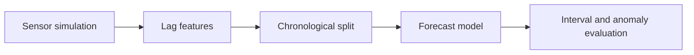

# Architecture

```mermaid
flowchart LR
    N0["Sensor simulation"] --> N1["Lag features"]
    N1["Lag features"] --> N2["Chronological split"]
    N2["Chronological split"] --> N3["Forecast model"]
    N3["Forecast model"] --> N4["Interval and anomaly evaluation"]
```

## Module boundaries

Each stage is deliberately implemented as a compact, inspectable reference pipeline. No external production service is required for the demonstration.
